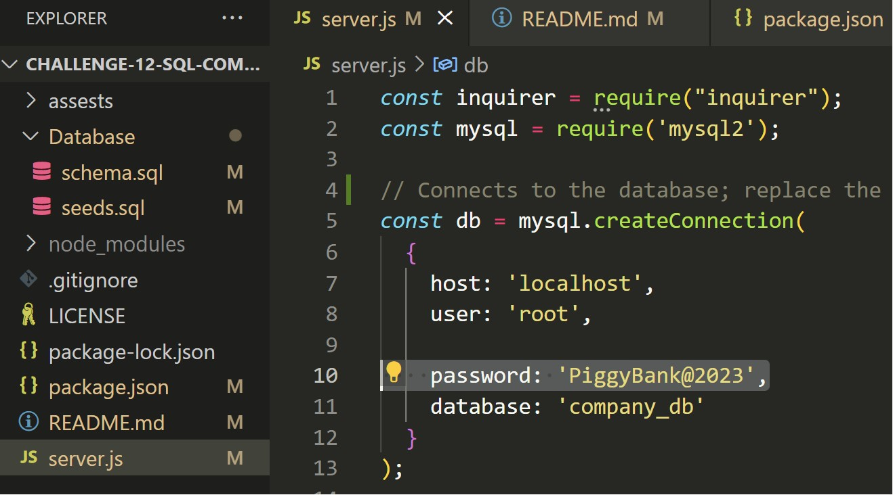

# Challenge-12-SQL-CompanyDB

## Description

This application can be used in the managing of departments, their employees, job roles, salaries and various other metrics.

## Table of Contents
* [Description](#description)
* [Installation](#installation)
* [Usage](#usage)
* [Contributions](#contributions)
* [License](#license)
* [Questions and Contacts](#questions-and-contacts)

## Installation

[Visual Studio Code](https://code.visualstudio.com/), [GitBash](https://git-scm.com/downloads), [MySql Server](https://dev.mysql.com/downloads/mysql/) and [Node.js](https://nodejs.org/en) must be installed onto the user’s computer. The recommended version of Node.js 18.17.1 LTS.

[Instructions for installing MySql Server](https://coding-boot-camp.github.io/full-stack/mysql/mysql-installation-guide)

Once the required software has been successfully installed on the computer, clone this GitHub repository to a desired folder on the computer.

[The Repository of the MySql Company Database](https://github.com/Hello-AndyJoe/Challenge-12-SQL-CompanyDB)

The cloned repository does not include the node_module foldr containing the Inquirer, Express or MySQL2 NPMs. Install them into the repository by running `npm i` in a GitBash terminal within Visual Studio Code. 

## Usage

After completing the necessary installations outlined above, the SQL database still needs to be created on the same computer with the cloned repository. 

Open a terminal in the Database folder that is within the cloned respoitior.

Input `mysql -u root -p`, hit enter and then input the password that is associated and was created during installation of the MySQL server. 

Next, enter `source schema.sql` to creat the database with its related tables and then enter `source seeds.sql` to seed the database's tables.

This terminal can now be exited, and then within the parent folder of the clone repository a new terminal should be opened. Before continuing, the password value in the `const db` variable at the top of the server.js file must be changed to match the password mentioned previously in this usage guide.

Enter `node server.js` to begin the starting prompt and select from the various options to either view a table, add to a table or update a table. These options will present addition prompts to follow to carry out the actions invovled.

[Video Showing the Company Database Usage](https://drive.google.com/file/d/1D6Ozek3lhWYjwluRuZ9ASty66CV-5CE7/view?usp=sharing)

## Contributions

All Activities of Module 12 - SQL where used for reference in the creation of this application.

The [W3 Schools Javascipt Maps](https://www.w3schools.com/js/js_object_maps.asp) was reference in creating the mapping needed to have various table options selectable in the inquirer prompt.

[NPM Inquirer 8.2.4](https://www.npmjs.com/package/inquirer/v/8.2.4) and its documentation used for the construction of the questions that appear via prompts. 

## License

MIT

## Questions and Contacts
Visit other repositories created by me at [github.com/hello-andyjoe](https://github.com/hello-andyjoe)

If you have questions, please email me at [andrew.joseph.roper@gmail.com](mailto:andrew.joseph.roper@gmail.com)